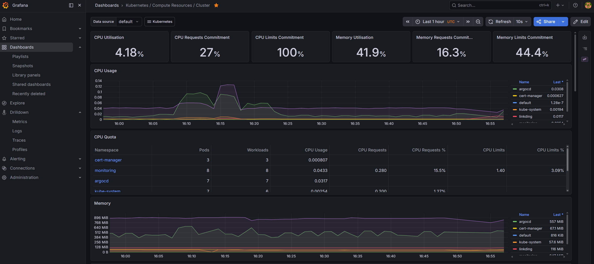
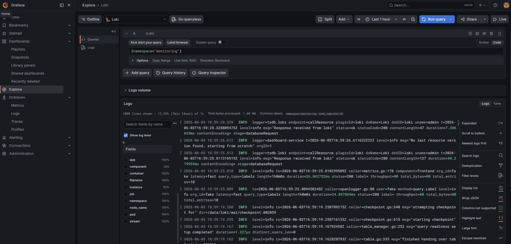
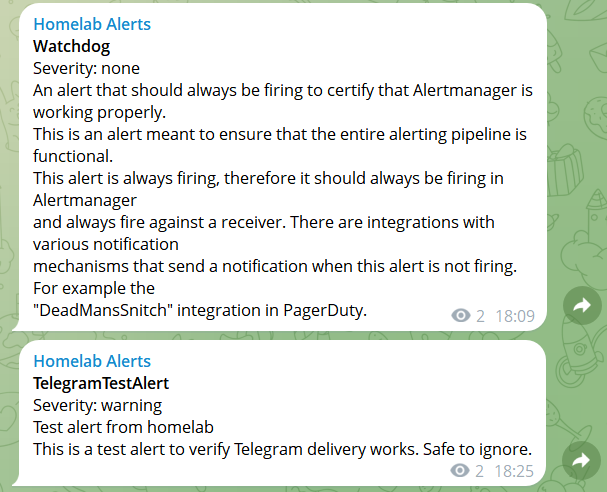

# Monitoring Stack

Full observability for the k3s cluster - metrics, logs, and alerting - deployed entirely through GitOps.

## Components

| Component                              | Role                                               |
| -------------------------------------- | -------------------------------------------------- |
| **Prometheus**                         | Metrics collection & storage (pull-based scraping) |
| **Grafana**                            | Visualization - 25+ preset Kubernetes dashboards   |
| **Loki + Promtail**                    | Centralized log aggregation across all pods        |
| **AlertManager**                       | Alert routing to Telegram                          |
| **node-exporter / kube-state-metrics** | Node and Kubernetes API metrics                    |

## Architecture

```
                  ┌──────────────┐
   scrapes  ┌────▶│  Prometheus  │────┐
   metrics  │     └──────────────┘    │ datasource
            │                         ▼
  ┌─────────┴───┐              ┌─────────────┐
  │ node-exporter│             │   Grafana   │◀── you
  │ kube-state   │             └─────────────┘
  │ pod metrics  │                    ▲
  └──────────────┘                    │ datasource
                  ┌──────────────┐    │
   ships    ┌────▶│     Loki     │────┘
   logs     │     └──────────────┘
            │
  ┌─────────┴───┐     ┌──────────────┐     ┌──────────┐
  │  Promtail   │     │ AlertManager │────▶│ Telegram │
  │ (DaemonSet) │     └──────────────┘     └──────────┘
  └──────────────┘            ▲
                              │ fires
                       ┌──────────────┐
                       │ PrometheusRule│
                       └──────────────┘
```

## Deployment

Deployed via **ArgoCD multi-source Application** - a clean separation between upstream charts and custom configuration:

- **Source 1 (Helm):** `kube-prometheus-stack` chart (v85.3.3) pulled directly from the upstream Prometheus Community repository.
- **Source 1 values:** custom `values.yaml` referenced from this git repo via `$values`.
- **Source 2 (Kustomize):** custom resources from git - `Certificate`, `Ingress`, and `PrometheusRule`.

Loki is deployed as a separate Application using the `loki-stack` chart.

This pattern keeps upstream charts pristine while versioning all customization in git.

## Secrets

Two Secrets are created **out-of-band** and never committed to git:

```bash
# Grafana admin login
kubectl create secret generic grafana-admin \
  --namespace monitoring \
  --from-literal=admin-user=admin \
  --from-literal=admin-password='<a-strong-password>'

# Telegram bot token for AlertManager
kubectl create secret generic telegram-bot-token \
  --namespace monitoring \
  --from-literal=token='<bot-token>'
```

Migrating these to External Secrets Operator + Azure Key Vault is on the roadmap.

## Access

- Grafana: `https://grafana.k8s.thelabdesk.com` (TLS via cert-manager + Let's Encrypt wildcard)

## Alerts

Three production-style alerts route to Telegram via AlertManager (bot token mounted from a Kubernetes Secret - never committed to git):

| Alert              | Condition                           |
| ------------------ | ----------------------------------- |
| `PodCrashLooping`  | Container restarted >3 times in 15m |
| `NodeMemoryHigh`   | Node memory usage >90% for 10m      |
| `CertExpiringSoon` | TLS certificate expires in <14 days |

The built-in `Watchdog` alert always fires, confirming the full pipeline (Prometheus → AlertManager → Telegram) is healthy.

## Screenshots

### Cluster overview (Grafana)



### Centralized logs (Loki)



### Alerts delivered to Telegram



## Query languages

- **PromQL** for metrics - e.g. `sum by (namespace) (rate(container_cpu_usage_seconds_total[5m]))`
- **LogQL** for logs - e.g. `{namespace="monitoring"} |= "error"`

## Lessons Learned

Real troubleshooting encountered while building this stack:

- **Resource planning.** The full monitoring stack consumes ~2GB RAM. On a single-node 4GB cluster this triggered cascading OOM events - Grafana CrashLoops, cert-manager webhook timeouts, and API server instability. Resolved by raising node memory. Takeaway: always budget for observability overhead.
- **k3s-specific tuning.** Disabled `kubeControllerManager`, `kubeScheduler`, `kubeProxy`, and `kubeEtcd` scrape targets, since k3s packages the control plane differently from vanilla Kubernetes - leaving them enabled produces permanent false alerts.
- **ArgoCD + bleeding-edge Kubernetes.** k8s 1.35 introduced a `.status.terminatingReplicas` field that older ArgoCD schemas don't recognize, breaking structured-merge diff. Resolved declaratively with `ignoreDifferences` on that status field.
- **Deprecated chart handling.** The `loki-stack` chart (deprecated) auto-provisions a Grafana datasource as default, conflicting with Prometheus. Resolved by disabling the chart's datasource provisioning and declaring Loki explicitly with `isDefault: false`.
- **GitOps over UI.** Adding a datasource through the Grafana UI broke pod startup on restart (duplicate default). All configuration belongs in git, not click-ops.

## Backlog

- Migrate from deprecated `loki-stack` to `loki` + Grafana Alloy
- Move stack to production cluster
- Add SLO/SLI recording rules
